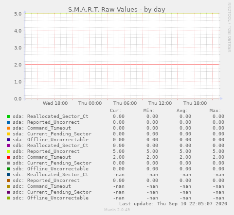

# Munin plugin for monitoring raw SMART values

## Project status

Beta software


## Overview

This plugin tracks raw values of SMART parameters for specified drives




## Installation and usage

To install this plugin you need to copy/symlink [smart_raw.py](smart_raw.py) to
Munin's plugin directory (usually `/etc/munin/plugins/`) and make that file
executable (`chmod +x`).

This plugin MUST be configured before use:

- `user` - either `root` or another user that can execute smartctl against all drives

Optional configuration parameters are:

- `env.smart_raw_drives` - Space separated list of drive names, e.g. "sda
  sdb". By default a `/dev/sd?` fileglob is used.
- `env.smart_raw_params` - IDs of SMART parameter to monitor. Default: "5 187 188 197 198" as recommended [by Backblaze](https://www.backblaze.com/blog/hard-drive-smart-stats/)
- `env.smart_raw_smartctl` - Custom path to smartctl executable. Default:
  `which smartctl`

More information on installation and configuration of plugins is available in
the [Munin Guide](http://guide.munin-monitoring.org/en/latest/plugin/use.html)


## Configuration example (`/etc/munin/plugin-conf.d/smart_raw`)

Short version with just the required bits:

```
[smart_raw.py]
user root
```

More specific target:

```
[smart_raw.py]
env.smart_raw_drives sda sdb
env.smart_raw_params 187 197 198
user root
```


## Support and contributing

If you need help with using this plugin please create [**an
issue**](https://github.com/sio/munin_plugin_smart_raw/issues). Issues are also
the primary venue for reporting bugs and posting feature requests. General
discussion related to this project is also acceptable and very welcome!

In case you wish to contribute code or documentation, feel free to open [**a
pull request**](https://github.com/sio/munin_plugin_smart_raw/pulls). That would
certainly make my day!

I'm open to dialog and I promise to behave responsibly and treat all
contributors with respect. Please try to do the same, and treat others the way
you want to be treated.

If for some reason you'd rather not use the issue tracker, contacting me via
email is OK too. Please use a descriptive subject line to enhance visibility
of your message. Also please keep in mind that public discussion channels are
preferable because that way many other people may benefit from reading past
conversations. My email is visible under the GitHub profile and in the commit
log.


## License and copyright

Copyright 2020 Vitaly Potyarkin

    Licensed under the Apache License, Version 2.0 (the "License");
    you may not use this file except in compliance with the License.
    You may obtain a copy of the License at

        http://www.apache.org/licenses/LICENSE-2.0

    Unless required by applicable law or agreed to in writing, software
    distributed under the License is distributed on an "AS IS" BASIS,
    WITHOUT WARRANTIES OR CONDITIONS OF ANY KIND, either express or implied.
    See the License for the specific language governing permissions and
    limitations under the License.
